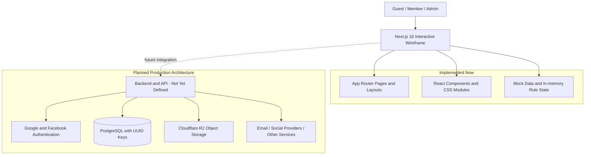
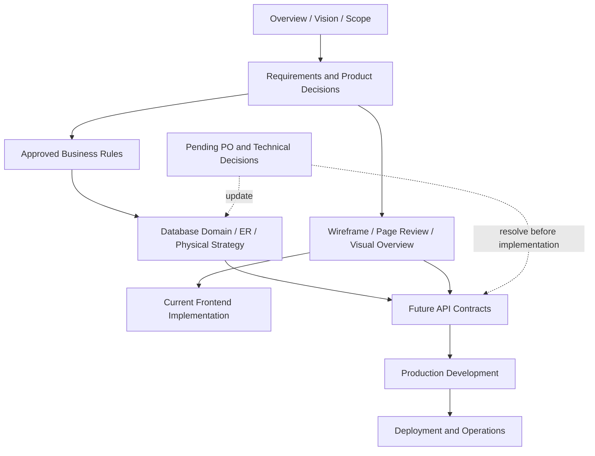

# NovelVerse

> คู่มือสถาปัตยกรรมหลักและจุดเริ่มต้นอย่างเป็นทางการสำหรับทำความเข้าใจผลิตภัณฑ์ ธุรกิจ Wireframe และสถาปัตยกรรมของ NovelVerse

| รายการ | ค่า |
|---|---|
| Project | NovelVerse |
| Project Description | แพลตฟอร์มสำหรับค้นพบ อ่าน และเผยแพร่นิยายกับการ์ตูนภาษาไทย พร้อมพื้นที่สมาชิก ครีเอเตอร์ ผู้ดูแลระบบ และโมเดลรายได้จากโฆษณา/สมาชิกไม่มีโฆษณา |
| Current Project Status | Interactive Wireframe สมบูรณ์และผ่านการทบทวน; Business Documentation และ Database Architecture ได้รับการยืนยัน; production backend, API, persistence และ deployment ยังไม่ได้ implement |
| Version | 0.1.0 |
| Revision | Handbook 1.0 |
| Last Updated | 19 กรกฎาคม 2569 (2026-07-19) |
| Document Owner | Chief Software Architect — NovelVerse |

## สารบัญ

1. [วิสัยทัศน์ผลิตภัณฑ์](#product-vision)
2. [โมเดลธุรกิจ](#business-model)
3. [บทบาทผู้ใช้](#user-roles)
4. [โมดูลระบบ](#system-modules)
5. [สถาปัตยกรรมระบบ](#system-architecture)
6. [แผนที่เอกสาร](#documentation-map)
7. [เอกสารโครงการปัจจุบัน](#current-documentation)
8. [สถานะโครงการปัจจุบัน](#current-project-status)
9. [Technology Stack](#technology-stack)
10. [มาตรฐานการพัฒนา](#coding-standards)
11. [การตัดสินใจทางสถาปัตยกรรม](#architecture-decisions)
12. [Roadmap](#future-roadmap)
13. [ดัชนีเอกสาร](#documentation-index)
14. [คู่มือนักพัฒนาใหม่](#new-developer-guide)
15. [อภิธานศัพท์](#glossary)
16. [ช่องว่างของเอกสาร](#documentation-gaps)
17. [Revision History](#revision-history)

## Product Vision

NovelVerse มีขึ้นเพื่อให้ผู้อ่านภาษาไทยค้นพบและอ่าน Novel/Comic ได้ง่าย และให้ Member ทุกคนเผยแพร่ผลงานได้โดยไม่ต้องมี Creator role แยก ผลิตภัณฑ์ให้ความสำคัญกับการอ่านแบบเปิด ไม่มี chapter paywall ใน MVP การค้นพบผลงาน การติดตามเรื่อง และเครื่องมือจัดการผลงาน/ชุมชน

### กลุ่มเป้าหมาย

- ผู้อ่านทั่วไปที่ต้องการสำรวจและอ่านโดยไม่จำเป็นต้องเข้าสู่ระบบ
- สมาชิกที่ต้องการติดตามเรื่อง บันทึกประวัติ และมีส่วนร่วมกับเนื้อหา
- นักเขียนและนักวาดที่ต้องการเผยแพร่และจัดการ Novel/Comic
- ผู้ดูแลระบบที่รับผิดชอบผู้ใช้ เนื้อหา รายงาน และ taxonomy
- ผู้ลงโฆษณาที่ใช้ Standard Advertisement หรือ Premium Popup ตามกฎที่ยืนยัน

### ปรัชญาธุรกิจ

- การอ่านเนื้อหาสาธารณะไม่ถูกล็อกด้วย paywall
- Member ทุกคนเป็น Creator ได้
- รายได้แพลตฟอร์มแยกจากเงินสนับสนุนครีเอเตอร์อย่างชัดเจน
- กฎสิทธิ์ โฆษณา และ moderation ต้องตรวจสอบย้อนกลับได้เมื่อพัฒนา production
- Wireframe เป็นหลักฐานด้าน flow/UX ไม่ใช่หลักฐานว่ามี backend หรือ security แล้ว

รายละเอียด: [ภาพรวมโครงการ](00_PROJECT_OVERVIEW.md), [ข้อกำหนด](01_REQUIREMENTS.md), [Business Rule Index](business/BUSINESS_RULE_INDEX.md)

## Business Model

| หัวข้อ | ข้อสรุป | เอกสารหลัก |
|---|---|---|
| รายได้ NovelVerse | มาจาก Advertisement และ Ad-free Membership | [Monetization](business/06_MONETIZATION.md) |
| Standard Advertisement | แสดง active ads ครบทุกใบเป็น vertical stack ก่อนเนื้อหา เรียง `sortOrder` แล้ว `id`; ไม่สุ่มหรือ rotate | [Advertisement](business/02_ADVERTISEMENT.md) |
| Premium Popup | placement แยก แสดงสูงสุดหนึ่งรายการ ปิดได้หลัง 5 วินาที และล็อก scroll/background/focus ระหว่างแสดง | [Advertisement](business/02_ADVERTISEMENT.md) |
| Ad-free Membership | ใช้ MembershipEntitlement เป็น source of truth; Ad-free Member ไม่เห็น standard ads, popup หรือ upsell | [Membership](business/01_MEMBERSHIP.md), [Domain Model](database/01_DOMAIN_MODEL.md) |
| Creator Donation/Support | ผู้สนับสนุนโอนตรงถึง Creator ผ่าน bank, PromptPay, QR หรือ external link; NovelVerse ไม่รับเงินและไม่หักเปอร์เซ็นต์ | [Creator](business/04_CREATOR.md), [Monetization](business/06_MONETIZATION.md) |
| Future Monetization | Coin-per-chapter เป็น Future และต้องไม่กระทบ MVP schema | [Database Design](database/03_DATABASE_DESIGN.md) |

ราคา ภาษี payment provider, advertiser billing และ entitlement renewal/refund ยังเป็น **⚠ Pending Product Owner Decision**

## User Roles

| บทบาท/สถานะ | ความหมายและสิทธิ์ปัจจุบัน |
|---|---|
| Guest | อ่านเนื้อหาสาธารณะ สำรวจหมวด/ค้นหา/ดูโปรไฟล์ได้; action อย่าง like, follow, comment และ report ต้องเข้าสู่ระบบ |
| Free Member | Member ที่ไม่มี MembershipEntitlement แบบไม่มีโฆษณาที่มีผล; เห็น Standard Ads และ Premium Popup |
| Ad-free Member | Member ที่มี entitlement มีผล; ไม่ใช่ role ใหม่และไม่เรียกว่า Premium role |
| Creator | capability ของ Member ทุกคน ไม่ใช่ authorization role แยก; สร้าง Novel/Comic และจัดการผลงานของตน |
| Admin | role ที่เข้าถึง Admin Dashboard และ moderation surfaces; ไม่เห็น Reader advertisements |

Wireframe ใช้ role state และ `isAdFreeMember` ใน browser เพื่อสาธิตเท่านั้น Production ต้องอาศัย User, SocialIdentity, server-side authorization และ MembershipEntitlement ตาม [Membership Rules](business/01_MEMBERSHIP.md) และ [Database Architecture](database/01_DOMAIN_MODEL.md)

## System Modules

| Module | ขอบเขต | สถานะ |
|---|---|---|
| Public Website | Home, Categories, Search, Story Detail, Creator Profile, Following, History, Login และ UX states | Wireframe พร้อม |
| Reader | Novel text, Comic images, chapter navigation, comments, like/report และ creator support placement | Wireframe พร้อม; persistence ยังไม่มี |
| Creator Dashboard | Overview, profile, stories, chapter management, comments, analytics และ settings | Wireframe พร้อม |
| Admin Dashboard | Users, Stories, Comments, Reports, Categories และ Tags | Wireframe พร้อม |
| Advertisement | Standard stack, Premium Popup, eligibility, countdown, scroll/focus lock และ ad-free upsell | Wireframe behavior พร้อม |
| Moderation | Safe report targets, Admin actions, warning-email audit, evidence, creator strikes และ publishing suspension 7 วัน | Architecture พร้อม; backend ยังไม่มี |
| Membership | Google/Facebook identities และ time-bound ad-free entitlement | Architecture พร้อม; authentication/backend ยังไม่มี |
| Search | UI และ mock filtering | มี Wireframe; ranking/index/search backend ยัง Pending |
| Analytics | Dashboard mock summaries | มี Wireframe; event model, collection และ definitions ยัง Pending |
| Future Modules | Slug redirects, notification center, coin-per-chapter, creator-follow, appeal workflow และ advanced search | Future; ไม่อยู่ใน MVP schema |

เส้นทางทั้งหมดดูได้ใน [Page Inventory](PAGE_INVENTORY.md), [Sitemap](SITEMAP.md) และ [Visual Screen Overview](visual/SCREEN_OVERVIEW.html)

## System Architecture

### ภาพรวม

### Frontend

- Next.js App Router และ React Server Components เป็นค่าเริ่มต้น
- Client Components ใช้เฉพาะ interaction/local state เช่น role switcher, dialogs, forms และ Premium Popup
- Global CSS และ CSS Modules สร้าง light responsive wireframe โดยไม่มี UI library
- `src/app` แบ่ง public route group, member dashboard และ admin dashboard

ดู [System Design](02_SYSTEM_DESIGN.md), [Folder Structure](06_FOLDER_STRUCTURE.md), [UI Guideline](07_UI_GUIDELINE.md)

### Backend และ API

ยังไม่มี Route Handler, Server Action, service layer, API client หรือ production backend รูปแบบ API, contract, versioning, validation, pagination, rate limit และ error format ยังไม่ได้กำหนด เอกสาร [API Design](05_API_DESIGN.md) เป็น capability inventory ไม่ใช่ endpoint specification

### Database

PostgreSQL เป็น planned engine และ principal entities ใช้ UUID primary keys สถาปัตยกรรมยืนยัน scoped slugs, structured Novel content, ordered ComicPage, referentially safe reports, moderation audit และ Creator Support แล้ว แต่ยังไม่มี schema, SQL หรือ migrations

ดู [Domain Model](database/01_DOMAIN_MODEL.md), [Conceptual ER](database/02_ENTITY_RELATIONSHIP.md), [Physical Strategy](database/03_DATABASE_DESIGN.md), [Naming](database/04_NAMING_CONVENTION.md), [Indexes](database/05_INDEX_STRATEGY.md)

### Storage

ไฟล์ภาพและ media อยู่ใน Cloudflare R2; PostgreSQL เก็บ MediaAsset metadata และ object key/URL ส่วน CDN behavior, upload limits, scanning และ retention ยัง Pending

### Authentication

MVP ใช้ Google และ Facebook social loginเท่านั้น SocialIdentity แยกจาก User เพื่อเชื่อมหลาย provider ต่อหนึ่ง User การเข้าสู่ระบบสำเร็จครั้งแรกต้องยอมรับ Terms of Service และรับทราบ Privacy Notice ก่อน account activation ส่วน account merge/unlink/recovery, session implementation และ security policy ยัง Pending

### External Services

Google/Facebook และ Cloudflare R2 เป็น providers ที่ยืนยันเชิงสถาปัตยกรรม ส่วน email delivery, CDN behavior, analytics, monitoring และ deployment providers ยังไม่ได้เลือก ไม่มี external advertising service หรือ real payment integration ใน wireframe

## Documentation Map

### ลำดับการไหลของความรู้

### ลำดับอำนาจเมื่อเอกสารต่างช่วงเวลาไม่ตรงกัน

1. คำตัดสินล่าสุดที่ระบุ Confirmed ใน `docs/business/` และ `docs/database/`
2. Requirements และ Product Decisions
3. System Design, Wireframe review และเอกสาร inventory ที่สะท้อน implementation ณ เวลาจัดทำ
4. Mock data/source code สำหรับยืนยัน behavior ปัจจุบัน ไม่ใช้แทน production business rule

ตัวอย่าง: [System Design](02_SYSTEM_DESIGN.md) เดิมระบุว่ายังไม่เลือก database/auth provider แต่ [Database Design revision 1.1](database/03_DATABASE_DESIGN.md) และ [Membership revision 1.1](business/01_MEMBERSHIP.md) ยืนยัน PostgreSQL, UUID และ Google/Facebook แล้ว ให้ใช้เอกสารเฉพาะทางฉบับล่าสุดเป็นข้อสรุป

## Current Documentation

| Document/Group | Purpose | Status |
|---|---|---|
| `00_PROJECT_OVERVIEW.md` | เป้าหมาย กลุ่มผู้ใช้ ขอบเขต และ baseline technology | Baseline; บาง architecture status ถูก supersede |
| `01_REQUIREMENTS.md` | Functional/non-functional requirements และ acceptance gaps | Active |
| `02_SYSTEM_DESIGN.md` | Frontend wireframe architecture และข้อจำกัด | Current implementation baseline; production section บางส่วนล้าสมัย |
| `03_WIREFRAME_REVIEW.md` | รีวิว Purpose/UX/Missing/Open/Approval รายหน้า | Reviewing/Draft ตามหน้าที่ระบุ |
| `04_DATABASE_DESIGN.md` | Inventory ของ mock model ก่อนออกแบบฐานข้อมูล | Historical baseline; ใช้ `database/` สำหรับ architecture ล่าสุด |
| `05_API_DESIGN.md` | Future capability inventory | Draft; ไม่มี API contract/implementation |
| `06_FOLDER_STRUCTURE.md` | Repository, routes และ components | Active baseline |
| `07_UI_GUIDELINE.md` | Visual tokens, responsive behavior และ accessibility | Active wireframe guideline |
| `08_ROADMAP.md` | Phase 0–6 | Baseline; phase statuses ต้อง sync กับความคืบหน้าล่าสุด |
| `09_CHANGELOG.md` | ประวัติ repository/document baseline | Active แต่ยังไม่รวมทุก decision ล่าสุด |
| `10_MEETING_NOTES.md` | Meeting template/action items | Template; ไม่มี meeting record ที่ยืนยัน |
| `11_PRODUCT_DECISIONS.md` | Confirmed/Open decision registry เดิม | Active baseline; business/database revisions ใหม่กว่าบางรายการ |
| `README_PROJECT.md` | สารบัญเอกสารชุดแรก | Superseded เป็น entry point โดย handbook นี้ |
| Inventory/Flow/Wireframe docs | Page map, sitemap, user flows, scope และ prototype decisions | Source material |
| `business/` | Approved business rules แยก 6 domainsและ index | Source of truth ด้านธุรกิจ |
| `database/` | Domain, ER, physical strategy, naming และ indexes | Planned database architecture source of truth |
| `visual/` | Offline visual overview และวิธี regenerate 68 screenshots | Active visual reference |

## Current Project Status

| Area | Progress | Evidence / Next Gate |
|---|---|---|
| Requirements | Documentation complete; ยังมี Pending PO decisions บางข้อ | [Requirements](01_REQUIREMENTS.md), [Business Index](business/BUSINESS_RULE_INDEX.md) |
| Wireframe | Interactive implementation และ visual capture พร้อม; รายหน้าใน review file ยังเป็น Reviewing/Draft | [Wireframe Review](03_WIREFRAME_REVIEW.md), [Visual Overview](visual/SCREEN_OVERVIEW.html) |
| Business | Approved และ consolidated | [Business Rule Index](business/BUSINESS_RULE_INDEX.md) |
| Database | Conceptual/architecture documentation complete | ต้องอนุมัติ Pending ก่อน physical schema/migrations |
| API | Capability inventory เท่านั้น | ต้องกำหนด API style, contracts, authorization และ errors |
| Development | Frontend wireframe 0.1.0; ไม่มี production backend/persistence | เริ่ม production implementation หลัง architecture gates |
| Deployment | ยังไม่เริ่ม | ต้องเลือก platform, environments, CI/CD, secrets, backup และ observability |

คำว่า “complete” ใน handbook นี้หมายถึง documentation phase ตามคำสั่งโครงการ ไม่ได้หมายถึง production-ready system

## Technology Stack

| Layer | Technology / Decision | Status |
|---|---|---|
| Frontend | Next.js 16.2.10 App Router, React/React DOM 19.2.4, TypeScript 5 | Implemented |
| Styling | Global CSS + CSS Modules, light responsive design | Implemented |
| Backend | ยังไม่ได้กำหนด | Not implemented |
| API | ยังไม่ได้กำหนด | Not implemented |
| Database | PostgreSQL | Planned/Confirmed |
| Primary Keys | UUID สำหรับ principal entities | Planned/Confirmed |
| Rich Content | Structured document; PostgreSQL JSONB เป็น physical candidate | Planned; schema/version Pending |
| Storage | Cloudflare R2 + MediaAsset metadata/object reference | Planned/Confirmed |
| Authentication | Google/Facebook social login; SocialIdentity แยกจาก User; versioned Terms/Privacy acceptance ก่อน activation | Planned/Confirmed |
| Email | Warning-email audit concept | Provider/implementation Pending |
| Deployment | Hosting/CDN/CI/CD/monitoring ยังไม่ได้กำหนด | Pending |
| Development Tools | ESLint 9, eslint-config-next 16.2.10, Playwright 1.61.1, npm scripts | Implemented |

## Coding Standards

Handbook ไม่สร้างมาตรฐานใหม่ ข้อปฏิบัติปัจจุบันที่พบมีดังนี้:

- ใช้ TypeScript strict mode และ Next.js App Router
- ใช้ Server Components เป็นค่าเริ่มต้น; Client Component เมื่อจำเป็นต้องใช้ state, event หรือ browser API
- แยก route/page ใน `src/app`, reusable UI ใน `src/components`, mock/domain helpers ใน `src/lib`
- ใช้ route groups/layout ตาม public, dashboard และ admin surfaces
- Styling ใช้ token/global rules ใน `globals.css` และ component-specific CSS Modules
- รักษา accessibility semantics, keyboard behavior, responsive desktop/mobile และ lint checks ตาม [UI Guideline](07_UI_GUIDELINE.md)
- ก่อนเขียน Next.js code ต้องอ่านคู่มือ version ที่ติดตั้งใน `node_modules/next/dist/docs/` ตาม `AGENTS.md`
- Database naming ใช้ plural `snake_case`, UUID `id`, `<entity>_id`, named constraints, audit timestamps, `display_order` และ scoped slug conventions ตาม [Database Naming Convention](database/04_NAMING_CONVENTION.md)
- งานที่เปลี่ยน UI ควรรัน `npm run lint`, `npm run build` และ regenerate visual artifacts ตาม [Visual README](visual/README.md)

มาตรฐาน test pyramid, unit/integration framework, formatting tool, commit/branch/PR convention และ backend coding standard: **ยังไม่ได้กำหนด**

## Architecture Decisions

| Decision | Summary | Reference |
|---|---|---|
| Social Authentication | MVP ใช้ Google/Facebook เท่านั้น; User เชื่อมหลาย SocialIdentity | [Membership](business/01_MEMBERSHIP.md) |
| Ad-free Entitlement | MembershipEntitlement มี start/end/status/source/future payment reference; boolean ไม่ใช่ source of truth | [Domain Model](database/01_DOMAIN_MODEL.md) |
| Reader Advertisements | Guest/Free Member เห็น standard stack ทั้งหมดก่อน content; Ad-free/Admin ไม่เห็น | [Advertisement](business/02_ADVERTISEMENT.md) |
| Premium Popup | แสดงสูงสุดหนึ่ง, ปิดหลัง 5 วินาที, modal focus/scroll lock และกลับต้น ad section หลังปิด | [Advertisement](business/02_ADVERTISEMENT.md) |
| Revenue | NovelVerse มีรายได้จาก advertisements และ ad-free membership | [Monetization](business/06_MONETIZATION.md) |
| Creator Support | Creator รับเงินสนับสนุน 100% โดยตรง; ไม่มี NovelVerse donation transaction/percentage deduction | [Creator](business/04_CREATOR.md) |
| Support Privacy | Public display เป็น opt-in; bank/PromptPay encrypted at rest และ masked; QR อยู่ Cloudflare R2 | [Monetization](business/06_MONETIZATION.md) |
| Legal Acceptance | เก็บ document version/time/User/source สำหรับ login, first publication และ public support enablement | [Membership](business/01_MEMBERSHIP.md) |
| Creator Identity | Member ทุกคนเป็น Creator ได้; profile เดียว; creator slug unique ทั้งระบบ | [Creator](business/04_CREATOR.md) |
| Public Story URL | `/@creator-slug/story-slug`; story slug unique ภายใน Creator; chapter slug unique ภายใน Story | [Database Design](database/03_DATABASE_DESIGN.md) |
| Chapter Ordering | ใช้ `display_order` อิสระจาก title และ displayed chapter number | [Domain Model](database/01_DOMAIN_MODEL.md) |
| Content Model | Novel ใช้ structured rich content; Comic มี ordered ComicPage records | [Conceptual ER](database/02_ENTITY_RELATIONSHIP.md) |
| Media | binary filesอยู่ Cloudflare R2; MediaAsset เก็บ metadata/object key/URL | [Database Design](database/03_DATABASE_DESIGN.md) |
| Database | PostgreSQL และ UUID primary keys สำหรับ principal entities | [Database Design](database/03_DATABASE_DESIGN.md) |
| Delete vs Archive | Creator delete ใช้ soft delete; Archive เป็น publication state แยก | [Domain Model](database/01_DOMAIN_MODEL.md) |
| Safe Reporting | Report target ใช้ typed relationships ที่มี referential integrity สำหรับ User/Story/Chapter/Comment | [Conceptual ER](database/02_ENTITY_RELATIONSHIP.md) |
| Strike Qualification | Report ไม่ใช่ strike; ต้องยืนยัน violation, ซ่อน affected Story/Chapter และส่ง warningที่มี reason/rule reference | [Moderation](business/05_MODERATION.md) |
| Publishing Suspension | active strike ลำดับที่ 3 ระงับเฉพาะ create/publish 7 วัน; reader/account/ผลงานอื่นไม่เปลี่ยน และ content restorationยัง manual | [Moderation](business/05_MODERATION.md) |
| Moderation Audit | เก็บ actor, time, reason, evidence, warning email และ resulting content state | [Moderation](business/05_MODERATION.md) |

## Future Roadmap

Roadmap นี้สรุปลำดับจากเอกสารเดิม ไม่กำหนดวันที่หรือ commitment ใหม่

### Current Sprint

- ปิดและส่งมอบ official handbook/documentation entry point
- รวบรวม Pending PO/technical decisions ที่เป็น blocker ของ physical implementation
- Synchronize status ใน overview, system design, roadmap, changelog และ product decisions เมื่อได้รับอนุญาตให้ปรับเอกสารเหล่านั้น

### Next Sprint

- Phase 2: แปลง database architecture เป็น physical schema/migration plan สำหรับ PostgreSQL
- ตัดสินใจ rich-content schema, media provider/security, retention และ entitlement transitions
- กำหนด API/authorization contract ก่อนเชื่อม Wireframe กับ backend

### Future

- Phase 3: Google/Facebook authentication, session และ server-side authorization
- Phase 4: เชื่อม Creator Dashboard, content/media และ creator support กับ persistence
- Phase 5: community interactions, reading progress และ moderation workflow จริง
- Phase 6: deployment, CI/CD, backup, observability, security และ launch readiness
- Slug history/redirect, notification center, coin-per-chapter, creator-follow และ appeals หลัง MVP ตามการอนุมัติ

### Long-term

- Search ภาษาไทยและ ranking ที่วัดผลได้
- Analytics/event architecture และ derived counters
- Scaling, caching, read models, partitioning หรือ dedicated search เมื่อมี workload จริง
- Payment integration สำหรับ ad-free membership เมื่อ pricing/compliance ได้รับการอนุมัติ

ดู [Roadmap ฉบับเต็ม](08_ROADMAP.md)

## Documentation Index

### General

- [00_PROJECT_OVERVIEW.md](00_PROJECT_OVERVIEW.md) — ภาพรวมและขอบเขต
- [01_REQUIREMENTS.md](01_REQUIREMENTS.md) — ข้อกำหนด
- [02_SYSTEM_DESIGN.md](02_SYSTEM_DESIGN.md) — สถาปัตยกรรม wireframe
- [03_WIREFRAME_REVIEW.md](03_WIREFRAME_REVIEW.md) — รีวิวรายหน้า
- [04_DATABASE_DESIGN.md](04_DATABASE_DESIGN.md) — mock-data database gap baseline
- [05_API_DESIGN.md](05_API_DESIGN.md) — API capability inventory
- [06_FOLDER_STRUCTURE.md](06_FOLDER_STRUCTURE.md) — โครงสร้าง repository
- [07_UI_GUIDELINE.md](07_UI_GUIDELINE.md) — UI และ accessibility
- [08_ROADMAP.md](08_ROADMAP.md) — Phase 0–6
- [09_CHANGELOG.md](09_CHANGELOG.md) — บันทึกการเปลี่ยนแปลง
- [10_MEETING_NOTES.md](10_MEETING_NOTES.md) — meeting template/notes
- [11_PRODUCT_DECISIONS.md](11_PRODUCT_DECISIONS.md) — decision registry
- [README_PROJECT.md](README_PROJECT.md) — สารบัญเอกสารเดิม
- [PAGE_INVENTORY.md](PAGE_INVENTORY.md) — รายการหน้า
- [SITEMAP.md](SITEMAP.md) — แผนผัง route
- [USER_FLOWS.md](USER_FLOWS.md) — flow ผู้ใช้
- [WIREFRAME_DECISIONS.md](WIREFRAME_DECISIONS.md) — คำตัดสิน wireframe
- [WIREFRAME_SCOPE.md](WIREFRAME_SCOPE.md) — ขอบเขต wireframe

### Business

- [BUSINESS_RULE_INDEX.md](business/BUSINESS_RULE_INDEX.md) — registry และ entry point ของ business rules
- [01_MEMBERSHIP.md](business/01_MEMBERSHIP.md) — roles, social identity และ entitlement
- [02_ADVERTISEMENT.md](business/02_ADVERTISEMENT.md) — standard ads และ Premium Popup
- [03_READING.md](business/03_READING.md) — discovery/reader/community actions
- [04_CREATOR.md](business/04_CREATOR.md) — publishing, content/media และ creator support
- [05_MODERATION.md](business/05_MODERATION.md) — reports, actions, warnings และ strikes
- [06_MONETIZATION.md](business/06_MONETIZATION.md) — รายได้และ direct creator support

### Database

- [01_DOMAIN_MODEL.md](database/01_DOMAIN_MODEL.md) — domains/entities/lifecycle
- [02_ENTITY_RELATIONSHIP.md](database/02_ENTITY_RELATIONSHIP.md) — conceptual ER และ ownership
- [03_DATABASE_DESIGN.md](database/03_DATABASE_DESIGN.md) — PostgreSQL physical strategy
- [04_NAMING_CONVENTION.md](database/04_NAMING_CONVENTION.md) — naming standards
- [05_INDEX_STRATEGY.md](database/05_INDEX_STRATEGY.md) — indexing philosophy/workloads

### Visual

- [visual/README.md](visual/README.md) — วิธีเปิดและ regenerate screenshots
- [visual/SCREEN_OVERVIEW.html](visual/SCREEN_OVERVIEW.html) — visual overview แบบ offline
- [visual/screenshots/](visual/screenshots/) — ภาพอ้างอิง desktop/mobile 68 ภาพ

## New Developer Guide

### ลำดับอ่านที่แนะนำ

1. อ่าน handbook นี้เพื่อทราบสถานะและลำดับอำนาจเอกสาร
2. อ่าน [Project Overview](00_PROJECT_OVERVIEW.md), [Requirements](01_REQUIREMENTS.md) และ [Business Rule Index](business/BUSINESS_RULE_INDEX.md)
3. เปิด [Visual Screen Overview](visual/SCREEN_OVERVIEW.html) ควบคู่กับ [Page Inventory](PAGE_INVENTORY.md) และ [User Flows](USER_FLOWS.md)
4. อ่าน business document ของ domain ที่จะทำงาน ห้ามสรุปจาก UI เพียงอย่างเดียว
5. อ่าน [System Design](02_SYSTEM_DESIGN.md) และ [Folder Structure](06_FOLDER_STRUCTURE.md) ก่อนแก้ frontend
6. ถ้าทำ persistence ให้อ่าน database documents ทั้ง 5 ฉบับตามลำดับ
7. ถ้าทำ integration ให้อ่าน [API capability inventory](05_API_DESIGN.md) และหยุดขอ decision ก่อนสร้าง contract ที่ยัง Pending
8. ตรวจ [Product Decisions](11_PRODUCT_DECISIONS.md), Pending sections และ Future scope ก่อนออกแบบ feature
9. รัน lint/build และ visual capture ตามประเภทการเปลี่ยนแปลง

### ข้อควรจำ

- Wireframe actions จำนวนมากไม่ persist
- UI guard ไม่ใช่ production authorization
- `isAdFreeMember` เป็น demo state ไม่ใช่ production source of truth
- Creator เป็น capability ของ Member ไม่ใช่ role
- Future idea ห้ามเพิ่มใน MVP schema โดยไม่มี decision ใหม่
- เมื่อเอกสารเก่าขัดกับ business/database revision ล่าสุด ให้ใช้ลำดับอำนาจใน [Documentation Map](#documentation-map)

## Glossary

| Term | ความหมาย |
|---|---|
| Story | ผลงานหลักประเภท Novel หรือ Comic เป็น aggregate root ของ Chapter |
| Chapter | ตอนของ Story มี slug และ `display_order` ภายใน Story |
| Creator | Member ที่เผยแพร่ผลงาน; ไม่ใช่ role แยก |
| Creator Slug | public identifier ของ Creator ที่ unique ทั้งระบบ |
| Story Slug | public identifier ที่ unique ภายใน Creator และใช้ใน `/@creator-slug/story-slug` |
| Entitlement | สิทธิ์ที่มีช่วงเวลา/สถานะ/แหล่งที่มา เช่น ad-free access |
| Free Member | Member ที่ไม่มี ad-free entitlement ที่มีผล |
| Ad-free Member | Member ที่มี ad-free entitlement ที่มีผล |
| Standard Advertisement | โฆษณาแบบ card ทุก active item ที่เรียงเป็น stack ก่อนเนื้อหา |
| Advertisement Stack | กลุ่ม Standard Ads แนวตั้งทั้งหมดที่ผู้ใช้ต้องเลื่อนผ่านก่อนอ่าน |
| Premium Popup | placement แยกที่บล็อก reader และปิดได้หลัง 5 วินาที |
| MediaAsset | metadata/object reference ของไฟล์ที่เก็บภายนอก PostgreSQL |
| ComicPage | หน้าภาพที่มีลำดับภายใน Comic Chapter |
| Moderation Action | บันทึกการตัดสินใจของ Admin พร้อม actor, time, reason, evidence และผลลัพธ์ |
| Creator Strike | confirmed content-policy violation หลัง Admin ซ่อน affected content และส่ง warning emailที่ครบถ้วน; ไม่รวม security incident |
| Publishing Suspension | การระงับสิทธิ์สร้าง/เผยแพร่ของ Creator แยกจาก account suspension; Strike 3 ทำให้เกิด 7 วันใน MVP |
| Legal Acceptance | หลักฐาน immutable ว่า User ยอมรับ document version ใด เมื่อใด และจาก interaction ใด |
| Display Order | ลำดับที่แก้ไขได้และไม่ผูกกับชื่อ/เลขตอนที่แสดง |
| Slug | business identifier ที่อ่านได้สำหรับ public URL; ไม่ใช่ UUID primary key |
| Soft Delete | ทำเครื่องหมายว่าลบโดยยังรักษาระเบียนเพื่ออ้างอิง/กู้คืน; ไม่เท่ากับ Archive |
| Archive | publication state ที่แยกจากการลบ |
| Source of Truth | แหล่งข้อมูลหลักที่ใช้ตัดสินระบบ เช่น MembershipEntitlement แทน boolean demo |

## Documentation Gaps

ช่องว่างต่อไปนี้ไม่เปลี่ยนกฎที่ยืนยัน แต่ควรปิดก่อน production implementation:

- เอกสาร general บางฉบับยังบอกว่า database/auth provider ไม่ได้เลือก ทั้งที่ database/business revisions ยืนยันแล้ว
- Roadmap ยังระบุ Database phase ว่าไม่เริ่ม และ Phase 3 provider ยังไม่กำหนด
- Product Decisions ยังไม่มี PostgreSQL/UUID, scoped slugs, creator support, safe reporting และ popup scroll/focus decisions ล่าสุด
- Changelog ยังไม่ครอบคลุม business/database architecture revisions และ Premium Popup bug fix ล่าสุด
- API contract, backend topology, session/authorization, error model และ upload protocol ยังไม่มี
- ไม่มี ADR governance, named approver, review cadence หรือ supersession process
- ไม่มี backend test standard, observability/SLO, privacy/retention matrix, threat model หรือ disaster-recovery runbook
- Wireframe Review ยังไม่มีหน้าที่เป็น Approved แม้ Product Design ถูกประกาศว่าสมบูรณ์ จึงควร sync approval evidence

### Recommendations

1. ทำ documentation synchronization release เพื่ออัปเดต Overview, System Design, Roadmap, Changelog และ Product Decisions ให้ตรงกับ handbook
2. สร้าง ADR index สำหรับคำตัดสินที่เปลี่ยน architecture โดยระบุ owner/date/supersedes
3. ปิด Pending decisions ที่ block schema/API ก่อน physical implementation
4. สร้าง API contract, security model, data-retention matrix และ media threat model ใน phase ถัดไป
5. กำหนด documentation review cadence และ automated link/Mermaid validation ใน CI

## Revision History

| Revision | Date | Owner | Change |
|---|---|---|---|
| 1.1 | 2026-07-19 | Lead PostgreSQL Database Architect | สะท้อน legal consent, support encryption/R2, publishing transitions และ seven-day publishing suspension |
| 1.0 | 2026-07-19 | Chief Software Architect — NovelVerse | สร้าง official master handbook เชื่อม product, business, wireframe, database และ visual documentation |
