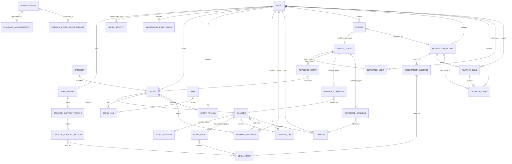

# แบบจำลองความสัมพันธ์เชิงแนวคิด (Conceptual ER Model)

## Purpose

แสดงเอนทิตีและ cardinality ระดับธุรกิจ โดยไม่ผูกกับชื่อ table, ชนิดข้อมูล หรือกลไกฐานข้อมูลจริง

## Scope

ครอบคลุมความสัมพันธ์ที่ยืนยันจาก Membership, Creator, Reading, Moderation และ Advertisement รวมทั้งทำเครื่องหมายจุดที่การบังคับความสัมพันธ์ยังต้องอนุมัติ

## Architecture Decisions

### Conceptual ER Diagram

Diagram นี้เป็น conceptual notation: Advertisement subtypes ไม่บังคับให้สร้าง table แยก ส่วน `REPORT_TARGET` เป็น exclusive association ที่ต้องมี child target เพียงชนิดเดียว กลุ่ม `REPORTED_*` ทำให้ทุก target มี foreign key จริงและหลีกเลี่ยงคู่ `target_type/target_id` ที่ตรวจ referential integrity ไม่ได้

### คำอธิบายความสัมพันธ์

| Relationship | Cardinality | Meaning / Ownership |
|---|---|---|
| User—UserProfile | 1:0..1 | User เป็นเจ้าของโปรไฟล์รวม; การไม่มีโปรไฟล์ชั่วคราวรองรับช่วงสร้างบัญชีที่ยังไม่ยืนยัน |
| User—SocialIdentity | 1:N | User เชื่อม Google/Facebook ได้หลาย provider; provider subject unique ภายใน provider |
| User—MembershipEntitlement | 1:N | เก็บ start/end/status/source และ future payment reference; ไม่ใช้ boolean เป็น source of truth |
| User—Story | 1:N | User/Creator เป็นเจ้าของ Story; Story เป็น aggregate root ของเนื้อหา |
| Category—Story | 1:N | Story มี Category หลักหนึ่งรายการ; Category ใช้ซ้ำได้ |
| Story—Tag ผ่าน StoryTag | M:N | junction ป้องกันการทำซ้ำและรองรับค้นหาจากทั้งสองทิศ |
| Story—Chapter | 1:N เชิงเจ้าของ | Chapter ไม่มีความหมายการเผยแพร่โดยไม่อ้าง Story และอยู่ใน lifecycle ของ Story aggregate |
| User—Story ผ่าน StoryFollow | M:N | Member ติดตาม Story ได้หลายเรื่อง และ Story มี follower หลายราย |
| User—Chapter ผ่าน ChapterLike | M:N | Member like Chapter ได้หลายตอน; บังคับไม่ให้ like ซ้ำต่อคู่ |
| User/Story—ReadingProgress | User 1:N และ Story 1:N | หนึ่งความคืบหน้าต่อคู่ User–Story เป็นแนวทาง MVP; chapter ล่าสุดเป็น optional reference |
| Chapter—Comment | 1:N | ความเห็นบน reader ผูกกับ Chapter; Story เข้าถึงความเห็นผ่าน Chapter |
| User—Report | 1:N | Report มีผู้รายงานหนึ่งราย; การรายงานแบบ Guest ไม่ได้รับการยืนยัน |
| Report—ReportTarget—typed target | exclusive 1:1 | target เดียวจาก User/Story/Chapter/Comment ผ่าน typed association ที่มี FK จริง |
| Report—ModerationAction | 1:N | รายงานอาจนำไปสู่หลาย action; report เองไม่ใช่ strike |
| ModerationAction—WarningEmail/CreatorStrike | 1:N และ 1:0..1 | strike เกิดเมื่อ Admin ยืนยัน violation และส่ง warning emailแล้วเท่านั้น |
| UserProfile—CreatorSupportProfile—Method | 1:0..1:N | bank/PromptPay/QR/link แสดงบนโปรไฟล์และท้าย Chapter; เงินไป Creator โดยตรง |
| Chapter—NovelContent/ComicPage | exclusive ตาม Story type | Novel มี structured rich content; Comic มี ordered pages ที่อ้าง MediaAsset |
| Advertisement—Subtype | inheritance | Advertisement เก็บความหมายร่วม; subtype กำหนดการเรียง stack หรือ countdown popup |

### ประเภทความสัมพันธ์และ aggregate

- **One-to-One**: UserProfile, ReportTarget และ NovelContent ต่อ Novel Chapter
- **One-to-Many**: User–Story, Story–Chapter, Category–Story, Chapter–Comment
- **Many-to-Many**: Story–Tag, User–Story follow และ User–Chapter like โดยใช้ associative entity
- **Inheritance**: STANDARD และ PREMIUM_POPUP เป็นชนิดย่อยของ Advertisement; ไม่ใช่ inheritance ของ User role
- **Composition**: Story ประกอบด้วย Chapter; การลบจริงหรือ cascade ยังไม่ยืนยัน
- **Aggregate Roots**: User, Story, Category, Tag, Report, ModerationAction, Advertisement และ CreatorSupportProfile

### Soft Delete และ ownership

Creator-initiated delete ของ UserProfile, Story, Chapter และ CreatorSupport data ใช้ soft delete โดย Archive ยังคงเป็น publication state แยก ข้อมูล moderation context ใช้ soft delete/retention ส่วน follow/like อาจลบความสัมพันธ์จริงเพื่อความเรียบง่าย

รายละเอียด retention, right-to-erasure, cascade และผู้มีอำนาจกู้คืนยังเป็น **⚠ Pending Product Owner Decision** โดยไม่เปลี่ยนข้อยืนยันเรื่อง creator soft delete

## Confirmed Decisions

- Creator เป็น User role Member ไม่ใช่เอนทิตีแยก
- Story เป็นเจ้าของ Chapter และถูกจัดหมวดด้วยหนึ่ง Category/หลาย Tag
- Follow และ Like เป็นความสัมพันธ์ต่างระดับกันอย่างชัดเจน
- Comment ปัจจุบันเป็น flat comment ไม่มี thread/reply
- Advertisement มีสอง subtype ที่มีพฤติกรรมต่างกัน
- Admin เป็น role และไม่ต้องมี Admin entity
- PostgreSQL และ UUID เป็นฐานของ principal entities
- slug uniqueness คือ Creator global, Story within Creator และ Chapter within Story
- Chapter ใช้ `display_order` อิสระจาก title/displayed number
- Report targets ทั้งสี่ชนิดใช้ referentially safe associations

## Pending Product Owner Decisions

- ⚠ Pending Product Owner Decision: User ต้องมี UserProfile เสมอตั้งแต่สร้างบัญชีหรือไม่
- ⚠ Pending Product Owner Decision: overlap/grace period และ status transitions ของ entitlement
- ⚠ Pending Product Owner Decision: การลบ Story จะ cascade, restrict หรือคง Chapter/interaction ไว้อย่างไร
- ⚠ Pending Product Owner Decision: strike expiry/reversal/threshold และ appeal workflow
- ⚠ Pending Product Owner Decision: provider unlink/merge/recovery rules
- ⚠ Pending Product Owner Decision: encryption/masking และ access control ของข้อมูล support method

## Future Considerations

Slug history/redirect, coin-per-chapter และ notification center เป็น Future และไม่อยู่ใน MVP ER อาจเพิ่ม Appeal, SearchDocument และ AnalyticsEvent เมื่ออนุมัติ

## Related Documents

- [Domain Model](01_DOMAIN_MODEL.md)
- [Database Design](03_DATABASE_DESIGN.md)
- [Reading Business Rules](../business/03_READING.md)
- [Moderation Business Rules](../business/05_MODERATION.md)

## Revision History

| Version | Date | Author | Change |
|---|---|---|---|
| 1.0 | 2026-07-19 | Lead Solution Architect | สร้าง conceptual ER และอธิบาย ownership/cardinality |
| 1.1 | 2026-07-19 | Lead Solution Architect | เพิ่ม social identity, content/media, safe report targets, moderation audit/strike และ creator support |
